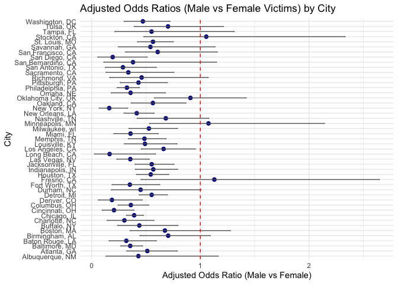
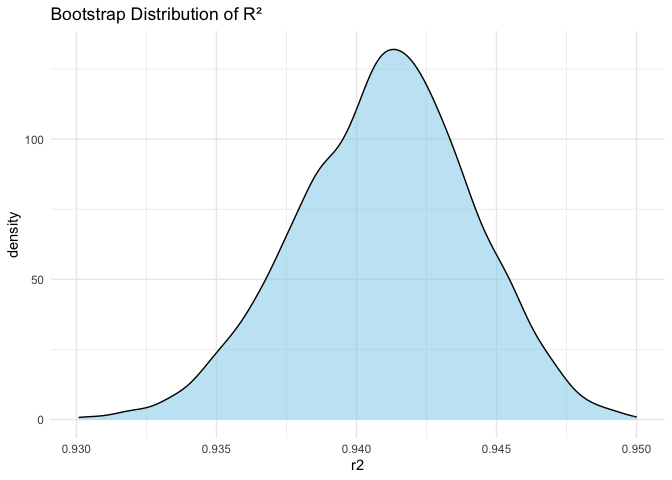
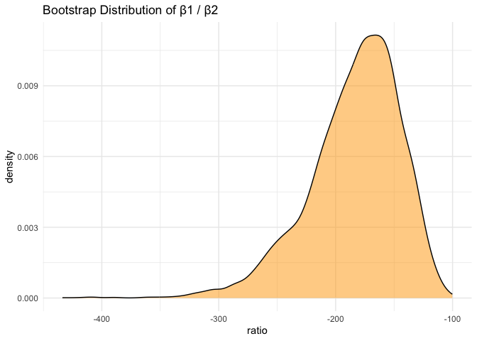
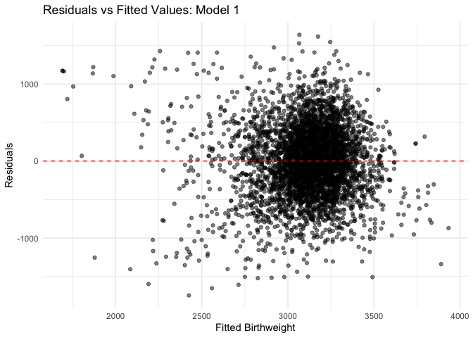

hw6
================
2025-12-02

## Q1

``` r
homi <- homi %>%
  mutate(
    city_state = paste(city, state, sep = ", "),
    solved = if_else(str_detect(disposition, "Closed"), 1, 0)
  ) %>%
  filter(!city_state %in% c("Dallas, TX", "Phoenix, AZ",
                            "Kansas City, MO", "Tulsa, AL")) %>%
  filter(victim_race %in% c("White", "Black")) %>%
  mutate(
    victim_age = na_if(victim_age, "Unknown"),
    victim_age = as.numeric(victim_age)
  )
```

``` r
# 1. Filter to Baltimore
balt <- homi %>%
  filter(city_state == "Baltimore, MD")

# 2. Fit logistic regression and save model object
fit_balt <- glm(
  solved ~ victim_age + victim_race + victim_sex,
  data = balt,
  family = binomial()
)

# 3. Tidy results with ORs and 95% CI
results_balt <- broom::tidy(
  fit_balt,
  exponentiate = TRUE,
  conf.int = TRUE
)

# 4. Display OR for all predictors (or filter)
results_balt %>%
  filter(term == "victim_sexMale") %>%   
  select(term, OR = estimate, conf.low, conf.high, p.value) %>%
  knitr::kable(digits = 3)
```

| term           |    OR | conf.low | conf.high | p.value |
|:---------------|------:|---------:|----------:|--------:|
| victim_sexMale | 0.355 |    0.267 |     0.468 |       0 |

``` r
city_results <- homi %>%
  group_by(city_state) %>%
  nest() %>%
  mutate(
    fit = map(data, ~ glm(
      solved ~ victim_age + victim_race + victim_sex,
      data = .x,
      family = binomial()
    )),
    tidy_fit = map(fit, ~ tidy(.x, exponentiate = TRUE, conf.int = TRUE))
  ) %>%
  unnest(tidy_fit) %>%
  filter(str_detect(term, "victim_sexMale")) %>%
  select(city_state, term, OR = estimate, conf.low, conf.high, p.value)
```

    ## Warning: There were 43 warnings in `mutate()`.
    ## The first warning was:
    ## ℹ In argument: `tidy_fit = map(fit, ~tidy(.x, exponentiate = TRUE, conf.int =
    ##   TRUE))`.
    ## ℹ In group 1: `city_state = "Albuquerque, NM"`.
    ## Caused by warning:
    ## ! glm.fit: fitted probabilities numerically 0 or 1 occurred
    ## ℹ Run `dplyr::last_dplyr_warnings()` to see the 42 remaining warnings.

``` r
city_results
```

    ## # A tibble: 47 × 6
    ## # Groups:   city_state [47]
    ##    city_state      term              OR conf.low conf.high  p.value
    ##    <chr>           <chr>          <dbl>    <dbl>     <dbl>    <dbl>
    ##  1 Albuquerque, NM victim_sexMale 0.430   0.132      1.16  1.22e- 1
    ##  2 Atlanta, GA     victim_sexMale 0.512   0.323      0.789 3.22e- 3
    ##  3 Baltimore, MD   victim_sexMale 0.355   0.267      0.468 3.74e-13
    ##  4 Baton Rouge, LA victim_sexMale 0.319   0.160      0.596 5.87e- 4
    ##  5 Birmingham, AL  victim_sexMale 0.704   0.444      1.09  1.25e- 1
    ##  6 Boston, MA      victim_sexMale 0.674   0.353      1.28  2.26e- 1
    ##  7 Buffalo, NY     victim_sexMale 0.438   0.239      0.793 6.78e- 3
    ##  8 Charlotte, NC   victim_sexMale 0.301   0.143      0.572 6.16e- 4
    ##  9 Chicago, IL     victim_sexMale 0.391   0.321      0.476 9.40e-21
    ## 10 Cincinnati, OH  victim_sexMale 0.206   0.0977     0.390 5.98e- 6
    ## # ℹ 37 more rows

``` r
city_results %>%
  mutate(city_state = fct_reorder(city_state, OR)) %>%   # order by OR
  ggplot(aes(x = OR, y = city_state)) +
  geom_point(size = 2, color = "darkblue") +
  geom_errorbarh(aes(xmin = conf.low, xmax = conf.high),
                 height = 0.2, color = "gray40") +
  geom_vline(xintercept = 1, linetype = "dashed", color = "red") +
  labs(
    title = "Adjusted Odds Ratios (Male vs Female Victims) by City",
    x = "Adjusted Odds Ratio (Male vs Female)",
    y = "City"
  ) +
  theme_minimal()
```

    ## Warning: `geom_errobarh()` was deprecated in ggplot2 4.0.0.
    ## ℹ Please use the `orientation` argument of `geom_errorbar()` instead.
    ## This warning is displayed once every 8 hours.
    ## Call `lifecycle::last_lifecycle_warnings()` to see where this warning was
    ## generated.

    ## `height` was translated to `width`.

<!-- -->

Compared to female, males on average are less likely to have their cases
solved. As from the plot, we can see most cities’ odds ratios fall under
1.

## Q2

``` r
library(p8105.datasets)
data("weather_df")
```

``` r
we_df <- weather_df
fit <- lm(tmax ~ tmin + prcp, data = we_df)
```

create a function

``` r
boot_fun <- function(df) {
  
  # resample rows with replacement
  boot_df <- df %>% sample_frac(replace = TRUE)
  
  # fit model
  fit_boot <- lm(tmax ~ tmin + prcp, data = boot_df)
  
  # extract R^2 from glance()
  r2 <- glance(fit_boot)$r.squared
  
  # extract coefficients
  coefs <- tidy(fit_boot)
  
  b1 <- coefs$estimate[coefs$term == "tmin"]
  b2 <- coefs$estimate[coefs$term == "prcp"]
  
  ratio <- b1 / b2
  
  # return a tibble
  tibble(r2 = r2, ratio = ratio)
}
```

``` r
set.seed(4)
boot_res <- map_dfr(1:5000, ~ boot_fun(weather_df))
```

R^2 plot

``` r
boot_res %>%
  ggplot(aes(x = r2)) +
  geom_density(fill = "skyblue", alpha = 0.5) +
  labs(title = "Bootstrap Distribution of R²") +
  theme_minimal()
```

<!-- -->

``` r
boot_res %>%
  ggplot(aes(x = ratio)) +
  geom_density(fill = "orange", alpha = 0.5) +
  labs(title = "Bootstrap Distribution of β1 / β2") +
  theme_minimal()
```

<!-- -->

``` r
r1 <- quantile(boot_res$r2, c(0.025, 0.975))

r2 <- quantile(boot_res$ratio, c(0.025, 0.975))
```

The 95% bootstrap confidence interval for $r^2$ is 0.935 to 0.947.

The 95% bootstrap confidence interval for $\hat\beta_1 / \hat\beta_2$ is
-274.129 to -123.928.

## Q3

``` r
bw <- read_csv("birthweight.csv") %>% clean_names() %>%              # clean variable names
  mutate(
    # Convert baby sex to factor
    babysex = factor(babysex,
                     levels = c(1, 2),
                     labels = c("male", "female")),
    
    # Convert malformation indicator to logical
    malform = factor(malform,
                     levels = c(0, 1),
                     labels = c("absent", "present")),
    
    # Convert parental race to factor
    frace = factor(frace,
                   levels = c(1, 2, 3, 4, 8, 9),
                   labels = c("white", "black", "asian", "puerto_rican", 
                              "other", "unknown")),
    
    mrace = factor(mrace,
                   levels = c(1, 2, 3, 4, 8),
                   labels = c("white", "black", "asian", "puerto_rican", "other")),
    
    # Ensure variables that are meant to be numeric are treated as numeric
    across(c(bhead, blength, bwt, delwt, fincome, gaweeks, menarche, 
             mheight, momage, parity, pnumlbw, pnumsga, ppbmi, ppwt, 
             smoken, wtgain),
           as.numeric)
  )
```

    ## Rows: 4342 Columns: 20
    ## ── Column specification ────────────────────────────────────────────────────────
    ## Delimiter: ","
    ## dbl (20): babysex, bhead, blength, bwt, delwt, fincome, frace, gaweeks, malf...
    ## 
    ## ℹ Use `spec()` to retrieve the full column specification for this data.
    ## ℹ Specify the column types or set `show_col_types = FALSE` to quiet this message.

``` r
bw_1 <- bw %>%
  mutate(
    babysex = factor(babysex),    # ensure babysex is factor
    fincome = as.numeric(fincome),
    gaweeks = as.numeric(gaweeks)
  )

fit1 <- lm(bwt ~ babysex + fincome + gaweeks, data = bw_1)
fit1
```

    ## 
    ## Call:
    ## lm(formula = bwt ~ babysex + fincome + gaweeks, data = bw_1)
    ## 
    ## Coefficients:
    ##   (Intercept)  babysexfemale        fincome        gaweeks  
    ##        489.58         -94.57           2.16          65.33

``` r
bw_1 %>%
  add_predictions(fit1) %>%
  add_residuals(fit1)%>%
  ggplot(aes(x = pred, y = resid)) +
  geom_point(alpha = 0.5) +
  geom_hline(yintercept = 0, color = "red", linetype = "dashed") +
  labs(
    x = "Fitted Birthweight",
    y = "Residuals",
    title = "Residuals vs Fitted Values: Model 1"
  ) +
  theme_minimal()
```

<!-- -->

This model is based on a combination of biological reasoning and
exploratory analysis. Gestational age is one of the strongest
determinants of fetal growth, while family income may influence maternal
health behaviors and prenatal care access. Baby’s sex is known to be
associated with small but systematic differences in average birthweight.

cross_validation

``` r
set.seed(2)

cv_df <- 
  crossv_mc(bw, n = 150) %>%   
  mutate(
    train = map(train, as_tibble),
    test  = map(test, as_tibble)
  )

cv_models <- cv_df %>%
  mutate(
    # Model 1
    mod1 = map(train, ~ lm(bwt ~ babysex + fincome + gaweeks, data = .x)),
    
    # Model 2
    mod2 = map(train, ~ lm(bwt ~ blength + gaweeks, data = .x)),
    
    # Model 3
    mod3 = map(train, ~ lm(bwt ~ bhead * blength * babysex, data = .x))
  )

cv_results <- cv_models %>%
  mutate(
    rmse_mod1 = map2_dbl(mod1, test, ~ rmse(.x, .y)),
    rmse_mod2 = map2_dbl(mod2, test, ~ rmse(.x, .y)),
    rmse_mod3 = map2_dbl(mod3, test, ~ rmse(.x, .y))
  )

cv_results %>%
  pivot_longer(
    starts_with("rmse"),
    names_to = "model",
    values_to = "rmse"
  ) %>%
  mutate(model = fct_inorder(model)) %>%
  group_by(model) %>%
  summarise(mean_rmse = mean(rmse)) %>%
  knitr::kable(digits = 2)
```

| model     | mean_rmse |
|:----------|----------:|
| rmse_mod1 |    461.05 |
| rmse_mod2 |    334.97 |
| rmse_mod3 |    289.20 |
